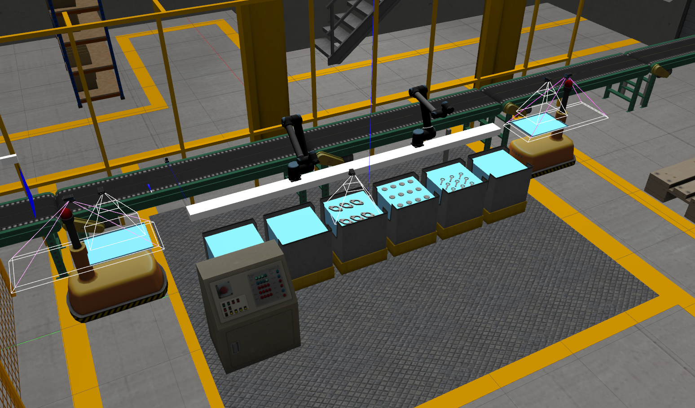

# ariac2019-docker
This repo has the docker containerization for [ARIAC2019](https://www.nist.gov/el/intelligent-systems-division-73500/agile-robotics-industrial-automation-competition)

### [sumanthnirmal/ros-melodic-gazebo9](https://hub.docker.com/r/sumanthnirmal/ros-melodic-gazebo9)

[](https://hub.docker.com/r/sumanthnirmal/ros-melodic-gazebo9)

[](https://hub.docker.com/r/sumanthnirmal/ros-melodic-gazebo9)

[](https://hub.docker.com/r/sumanthnirmal/ros-melodic-gazebo9)

[](https://microbadger.com/images/sumanthnirmal/ros-melodic-gazebo9:ariac2019)

[](https://microbadger.com/images/sumanthnirmal/ros-melodic-gazebo9:ariac2019)

## Requirements

- This requires the following packages to be installed on the host machine
  - [docker](https://www.docker.com/), can be installed from here https://docs.docker.com/install/linux/docker-ce/ubuntu/
  - `nvidia-docker2`, can be installed from here https://github.com/NVIDIA/nvidia-docker#quickstart

     #### `nvidia-docker2` can be installed on Ubuntu 14.04/16.04/18.04
    ```sh
    # If you have nvidia-docker 1.0 installed: we need to remove it and all existing GPU containers
    docker volume ls -q -f driver=nvidia-docker | xargs -r -I{} -n1 docker ps -q -a -f volume={} | xargs -r docker rm -f
    sudo apt-get purge -y nvidia-docker

    # Add the package repositories
    curl -s -L https://nvidia.github.io/nvidia-docker/gpgkey | \
      sudo apt-key add -
     distribution=$(. /etc/os-release;echo $ID$VERSION_ID)
    curl -s -L https://nvidia.github.io/nvidia-docker/$distribution/nvidia-docker.list | \
      sudo tee /etc/apt/sources.list.d/nvidia-docker.list
    sudo apt-get update

    # Install nvidia-docker2 and reload the Docker daemon configuration
    sudo apt-get install -y nvidia-docker2
    sudo pkill -SIGHUP dockerd

    # Test nvidia-smi with the latest official CUDA image
    docker run --runtime=nvidia --rm nvidia/cuda:9.0-base nvidia-smi
    ```
- This also requires a directory named `ariac2019_home` in the `/home` directory on host machine, which will be mounted as `/home` directory inside the docker container. This directory can be accessed inside the container.

## Quick-start

```sh
# clone this repo
$ git clone https://github.com/sumanth-nirmal/ariac2019-docker.git
$ cd ariac2019-docker
# Start the docker container for ARIAC2019
~/ariac2019-docker$ bash ariac2019_docker.sh start

# Enter the container
~/ariac2019-docker$ bash ariac2019_docker.sh enter

# launch ARIAC2019 sample environment
$ roslaunch osrf_gear sample_environment.launch
```

This should launch the sample environment as shown below:



## ariac2019-dcoker script
The bash script `ariac2019-docker.sh` handles the start, stop of the docker
#### Usage:

##### Start
To start the `ariac2019_docker` container

```sh
$ bash ariac2019-docker.sh start
```
This should automatically pull the image from [dockerhub](https://hub.docker.com/r/sumanthnirmal/ros-melodic-gazebo9) (to locally build the image, check the next section below) and should start the container with `ariac2019_docker_container` name and user `developer`. The directory `/home/ariac2019_home` on the host machine will be mapped as `/home` inside the docker with correct X forwarding so any processes inside the container can connect to the x server.

If the `ariac2019_docker_container` is already started, it can be restarted as below:

```sh
$ bash ariac2019-docker.sh start -f
```
##### Enter
Once the `ariac2019_docker_container` is started, we can enter the `ariac2019_docker_container` environment as follows:

```sh
$ bash ariac2019-docker.sh enter
```
This should automatically connect to the `ariac2019_docker_container` instance

##### Stop
To stop the `ariac2019_docker_container` container

```sh
$ bash ariac2019-docker.sh stop
```
This should automatically stop the docker

## Docker file

The repository contains the Dockerfile which is based on `Ubuntu 18.04` with `nvidia-docker2` beta opengl support https://hub.docker.com/r/nvidia/opengl. The Dockerfile contians the following packages

- [ros-melodic-desktop-full](http://wiki.ros.org/melodic)
- [gazebo9](http://gazebosim.org/)
- ariac3

Also has some utilities like `git`, `git-gui`, `vim`, `htop`, `terminator`, `atom` etc.

#### Build Docker image

The docker image can be built locally as below:

```sh
$ cd ariac2019-docker
~/ariac2019-docker$ docker build --tag=ariac2019_docker .
```
